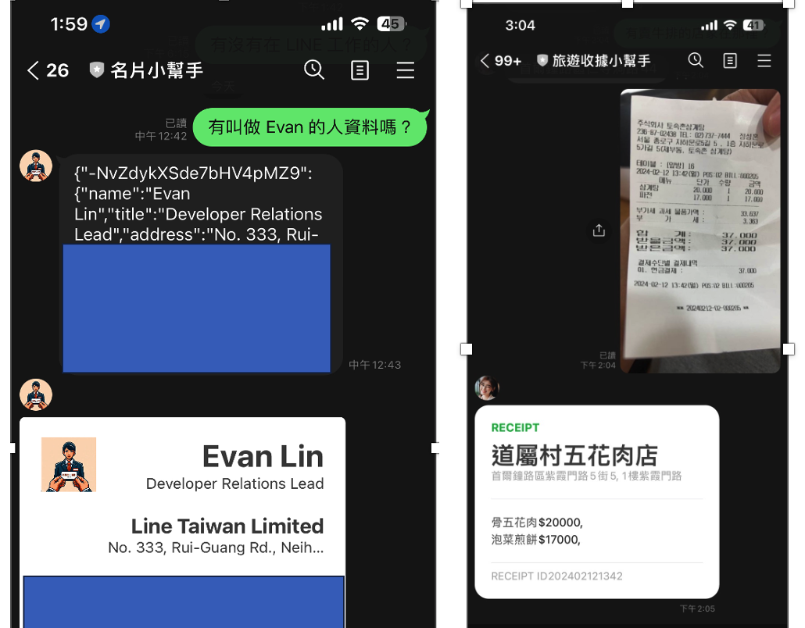

# BwAI-2024

Google Build with AI workshop 2024 Taiwan material and links

## 活動內容

[GDG Event Page](https://gdg.community.dev/events/details/google-gdg-taipei-presents-build-with-ai-2024-si-yue-gong-zuo-fang-shi-yong-gemini-pro-vision-api-da-zao-chu-guo-lu-you-de-xiao-bang-shou/)

## Gemini API 的提示範例

[Gemini API 的提示範例](https://ai.google.dev/examples?utm_source=hackathon&utm_medium=referral&utm_campaign=DevPost&hl=zh-tw)

# 文章列表

- [[BwAI workshop][Golang] LINE OA + CloudFunction + GeminiPro + Firebase = 旅行小幫手 LINE 聊天機器人(一)： 景色辨識小幫手](https://www.evanlin.com/linebot-cloudfunc-firebase-gemini-workshop/)
- [[BwAI workshop][Golang] LINE OA + CloudFunction + GeminiPro + Firebase = 旅行小幫手 LINE 聊天機器人(2)： Firebase Database 讓 LINEBot 有個超長記憶](https://www.evanlin.com/linebot-cloudfunc-firebase-gemini-workshop2/)
- [[BwAI workshop][Golang] LINE OA + CloudFunction + GeminiPro + Firebase = 旅行小幫手 LINE 聊天機器人(3)： 導入名片小幫手跟收據小幫手](<https://www.evanlin.com/linebot-cloudfunc-firebase-gemini-workshop3/>)

# 事前準備

- **[LINE Developer Account](https://developers.line.biz/en/)**: 你只需要有 LINE 帳號就可以申請開發者帳號。
- [**Google Cloud Functions**](https://cloud.google.com/functions?hl=zh_cn)： ＧGo 程式碼的**部署平台**，生成供 LINEBot 使用的 webhook address。
- [**Firebase**](https://firebase.google.com/)：建立**Realtime database**，LINE Bot 可以記得你之前的對話，甚至可以回答許多有趣的問題。
- **[Google AI Studio](https://aistudio.google.com/)**:可以透過這裡取得 Gemini Key 。

### 程式碼列表

- [名片小幫手（舊版用 Golang + Notion）](https://github.com/kkdai/linebot-smart-namecard)
- [收據小幫手（Python 舊版)](https://github.com/kkdai/linebot-receipt-gemini)
- [辨識圖片 LINEBot](https://github.com/kkdai/linebot-cloudfunc-gemini-go)
- [具有長記憶的聊天機器人](https://github.com/kkdai/linebot-cf-firebase)
- [名片小幫手（新版： Golang + Firebase RealtimeDB + Cloud Functions)](https://github.com/kkdai/linebot-cf-namecard)
- [收據小幫手（新版： Python -> Golang + Firebase DB + Cloud Functions)](https://github.com/kkdai/linebot-cf-receipt)
